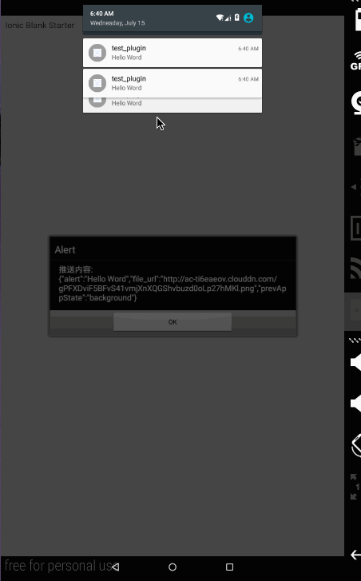
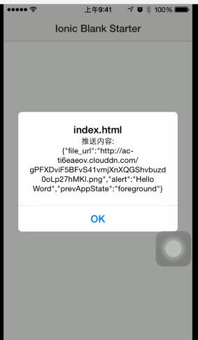

cordova-plugin-leanpush
========================

Cordova plugin for [LeanCloud](https://leancloud.cn) push notification


## Installation


- Fetch from cordova npm

```shell
 cordova plugin add cordova-plugin-leanpush  --variable LEAN_APP_ID=<YOUR_LEANCOULD_APP_ID> --variable LEAN_APP_KEY=<YOUR_LEANCOULD_APP_KEY>
```


- Add this to your `gulpfile.js`

```js
gulp.task('lpush-install', function(done){
    require('./plugins/cordova-plugin-leanpush/lpush-installer.js')(__dirname, done);
});
```

- `npm install --save-dev xml2js && npm install`

- Then exectue this gulp task by running `gulp lpush-install` in shell.

- Done.

### Known Android Build Issue

See [Attention/Android Build Issue](#android-build-issue)


## Usage

### Init


Put the initialization Code in your "deviceReady" Code Block (like $ionicPlatform.ready)

```js
window.LeanPush.init(function(){});
```

The Init accepts a optional function as the callback when the notification recieves *(Simply call onNotificationReceived on this function)*.


### Push Related API


Coresponding to the [Leancloud Push documentation](https://leancloud.cn/docs/ios_push_guide.html).

```js
window.LeanPush.subscribe(channel, success, error)  // 订阅频道
window.LeanPush.unsubscribe(channel, success, error) //退订频道
window.LeanPush.clearSubscription(success, error) //退订所有频道
window.LeanPush.getInstallation(success, error)  //Installation 表示一个允许推送的设备的唯一标示, 对应数据管理平台中的 _Installation 表
window.LeanPush.onNotificationReceived(callback) // 一个notification到来的回调函数
```

Many Thanks to [Derek Hsu](https://github.com/Hybrid-Force) XD 😁


### About Sending Push

Use the [Js Api: AV.Push](https://leancloud.cn/docs/js_guide.html#Push_通知) that leancloud provide.


### LeanAnalytics API

Corresponding code is forked from [https://github.com/Hybrid-Force/cordova-plugin-leancloud](https://github.com/Hybrid-Force/cordova-plugin-leancloud).


Only a novice for leancloud I am, so

- take a look at the source code [https://github.com/BenBBear/cordova-plugin-leanpush/blob/master/www/LeanAnalytics.js](https://github.com/BenBBear/cordova-plugin-leanpush/blob/master/www/LeanAnalytics.js) to know the API

- and study the [Leancloud documentation about leanAnalytics](https://leancloud.cn/docs/ios_statistics.html)

is the better way to go.


---

## Screen Recording

### Android


### IOS

See the [Attention Below](#attention), the webview can't `alert` when `onResume`, so here only

1. notice from close
2. notice while foreground




## Behavior

The `onNotificationReceived callback`  and the `$rootScope.$emit('leancloud:notificationReceived')` will fires when

### IOS

- app in the foreground, notice comes (won't show the system notification alert)
- app in the background, tap the notification to resume it
- app closed, tap the notification to open it

### Android


- app in the foreground, tap the notification to see it
- app in the background, tap the notification to resume it
- app closed, tap the notification to open it


## Attention

### Android Quirk

In order to receive push from android, I change the default `MainActivity` and `Application Entry`  in that gulp task. Details in the [lpush_installer.js](https://github.com/BenBBear/cordova-plugin-leanpush/blob/master/lpush-installer.js).

> So if you use another plugin that also goes this way, then there gonna be conflicts.


#### Uninstall

For fully uninstallation:

```shell
cordova plugin rm cordova-plugin-leanpush
ionic platform rm android && ionic platform rm ios
ionic platform add android && ionic platform add ios
```

### Don't Use Alert in the IOS inside Notification Callback

> `alert` is a blocking function.

#### IOS UIWebView

It will cause the app to freeze when you resume the app by clicking notification. (but it seems ok when the app is in the foreground or closed.)

###  For Android

As far as I try, `alert` is fine, guess is the difference of webView between  IOS and android.


### Notification Handler

There are two ways, both will be fired when notification comes

- `onNotificationReceived`

- `$rootScope.$emit('leancloud:notificationReceived')`


You can choose one of them, but may not both.


###  Android Build Issue

- **Error: duplicate files during packaging of APK**

**How to Solve:**


insert following code into the **android tag** of `platforms/android/build.gradle`

```groovy
 packagingOptions {
       exclude 'META-INF/LICENSE.txt'
 	   exclude 'META-INF/NOTICE.txt'
}
```

It should look like below

```groovy
android{
   packagingOptions {
       exclude 'META-INF/LICENSE.txt'
 	   exclude 'META-INF/NOTICE.txt'
   }
    //stuff
}
```


## LICENSE

The MIT License (MIT)

Copyright (c) 2015 Xinyu Zhang, Derek Hsu
